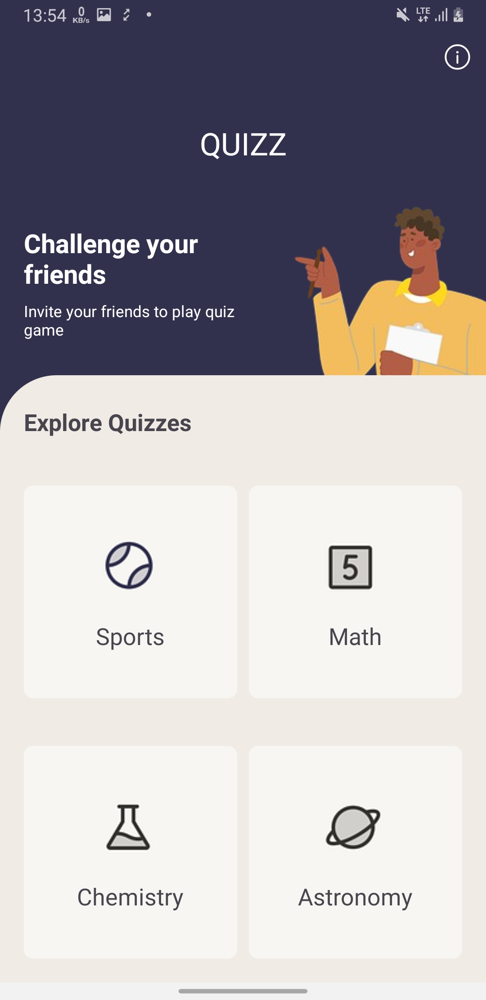
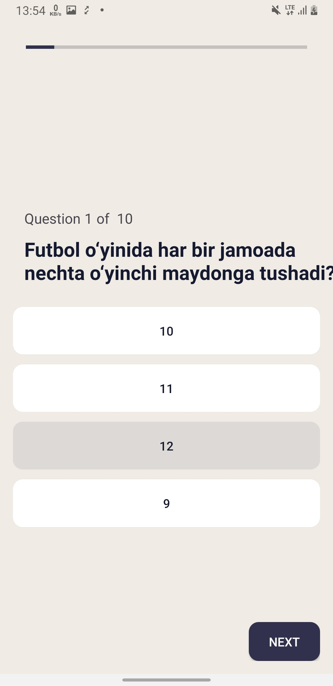
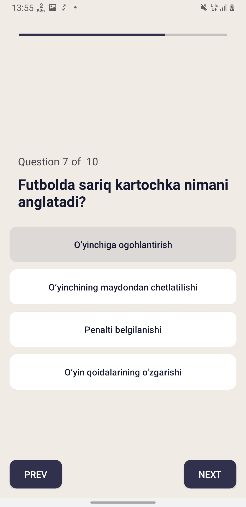
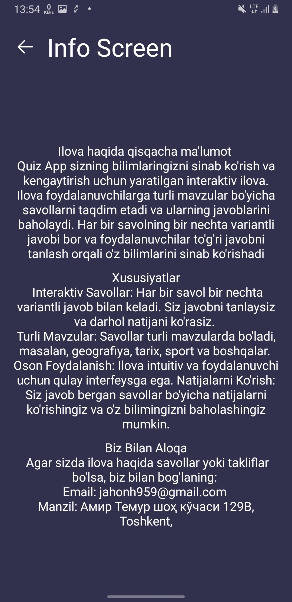

# 🧠 Quiz App
Quiz App is a simple and interactive Android application developed in Java that allows users to test their knowledge through multiple-choice questions. The app is structured using a Multi-Activity approach for smooth navigation between screens such as the home screen, quiz screen, and result screen.

# 🎯 Features
✅ Multiple Choice Questions – Answer interesting questions from various topics.

🔄 Multi-Activity Structure – Each screen is a separate activity (Start, Quiz, Result).

🧭 Navigation – Intuitive flow between activities.

🧼 Clean UI – Simple and user-friendly design for a great quiz experience.

# 🛠 Tech Stack

Technology	Description

Java	Main programming language

XML	UI layout design

Multi Activity	Each part of the app uses a dedicated activity

Intent	Used for data passing between activities

Bundle	Stores and transfers user responses and scores

#

  
  
  
  
  

# 🚀 Running the Project
Download the APK and try it out.

Author: [Hasanov Jahongir]

Contact: [jahonh959@gmail.com]
